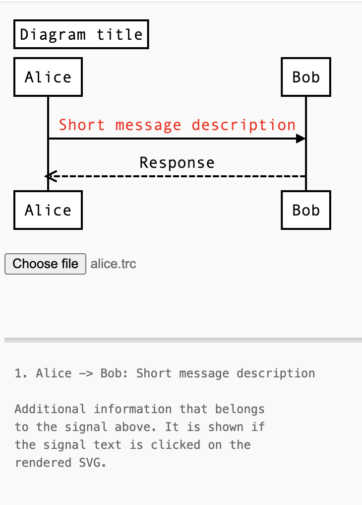

# ASDF Vector

ASDF Vector is an interactive vector graphics tool for visualizing
sequence diagrams in the Augmented Sequence Diagram Format (ASDF).


## Input example

```
title: Dialogue of Alice and Bob
Alice->Bob: Hey Bob, how you doin'?
	~~~ {"ts": "2024-11-11T15:20:43.320", "size": 116}
Additional information that belongs
toe signal above. It is shown if
the signal text is clicked on the
rendered SVG.
	~~~
Note over Bob: Hmm, what does she want?
Bob-->>Alice: Oh, hi
	~~~ {"ts": "2024-11-11T15:34:22.460", "special": true, "size": 85}
Bob is not a talkative person on the
surface but might have something to say
to Alice
	~~~
```

## Rendered diagram example




## Usage

Open `index.html`, choose a file of the syntax shown above
and explore the visualization.


## Dependencies

### `js/sequence-diagrams.js`

taken from https://github.com/xsnpdngv/seqdiag-js which is a
modification of https://github.com/bramp/js-sequence-diagrams to handle
the extra syntax for additional information between tilde-triplets
(`~~~`).


### `js/raphael.js`

https://github.com/DmitryBaranovskiy/raphael


### `js/underscore.js`

https://github.com/jashkenas/underscore

