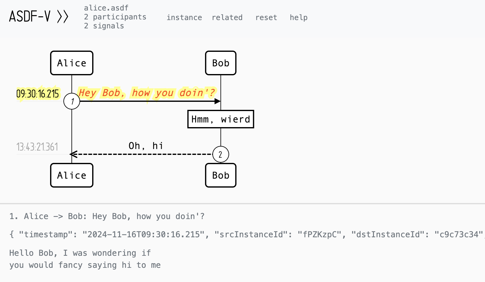

# ASDF-V

ASDF-V is an interactive vector graphics tool for visualizing sequence
diagrams in the Augmented Sequence Diagram Format (ASDF).  Generate
message-sending traces in an ASDF-compliant file and explore them
visually with intuitive controls.  It works both as a Visual Studio Code
extension and as a standalone web application, including fully local use
without a server.

## Features

- View/peek additional signal information on click/hover
- Hide, unhide and reorder participants as preferred
- Filter signals by hiding participants
- Highlight active signal and relations by coloring when needed
- Emphasize special signals by coloring
- Keep visualization preferences in the browser's local storage
- Decorate signals with sequence numbers and timestamps
- Paginate large diagrams, so they render promptly
- Keep participants at the top inside view for tall diagrams
- Move around and search the diagram with Vim-like keyboard shortcuts
- Show help page with keyboard shortcut reference
- Handle diagram data exclusively locally in the browser


## Input example

```
"Alice"->"Bob": Hey Bob, how you doin'?
	~~~ { "timestamp": "2024-11-16T09:30:16.215", "srcInstanceId": "fPZKzpC", "dstInstanceId": "c9c73c34", "size": 32, "isSpecial": true }
Hello Bob, I was wondering if
you would fancy saying hi to me
	~~~

note over "Bob": Hmm, wierd
	~~~ { "timestamp": "2024-11-16T09:30:17.689", "srcInstanceId": "c9c73c34", "size": 0 }
	~~~

"Bob"-->>"Alice": Oh, hi
	~~~ { "timestamp": "2024-11-16T13:43:21.361", "srcInstanceId": "c9c73c34", "dstInstanceId": "fPZKzpC", "size": 6 }
Oh, hi
	~~~
```

## Rendered diagram example




## ASDF Syntax

### document:


### add-info:


### name-value:


## Usage

### Browser

The ASDF visualizer can be used as a standalone web application.

1. Open `index.html` in a browser.
2. Click Open and select an ASDF file that follows the syntax shown above.
3. The file is parsed and rendered as an interactive sequence diagram.

### Visual Studio Code

The same visualizer is also available as a VS Code extension.

1. Install the [ASDF-V extension](https://marketplace.visualstudio.com/items?itemName=voidcsillag.asdf-v) from the VS Code Marketplace.
2. Open any `.asdf` file in the editor.
3. The diagram preview opens automatically and updates as the file changes.

As an alternative to installing the package from the marketplace (step
1), the extension can be built as a `.vsix` package and then be debugged
or installed manually:

```bash
git clone https://github.com/xsnpdngv/ASDF-V.git
cd ASDF-V

npm install
npm run compile

npm install -g @vscode/vsce # if not installed yet
vsce package

code --install-extension asdf-v-<version>.vsix
```


## Dependencies

This project uses the following 3rd party javascript files residing
in the `js/3rd-party` directory.

### `sequence-diagrams.js`

This one is taken from https://github.com/xsnpdngv/seqdiag-js which is a
modification of https://github.com/bramp/js-sequence-diagrams to handle
the extra syntax that makes ASDF _augmented_ in comparison to the well
known sequence diagram format, that is the additional information
between tilde-triplets (`~~~`).


### `raphael.js`

https://github.com/DmitryBaranovskiy/raphael


### `underscore.js`

https://github.com/jashkenas/underscore
